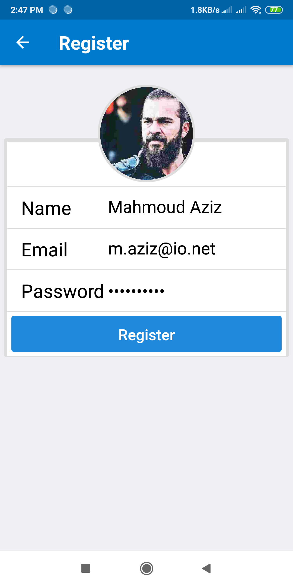
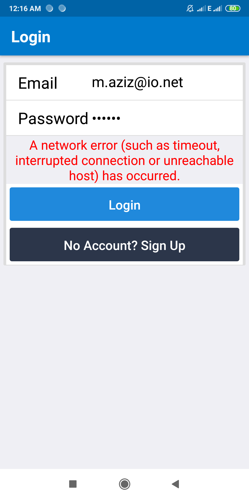
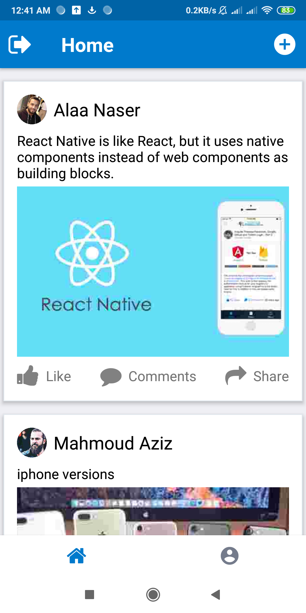
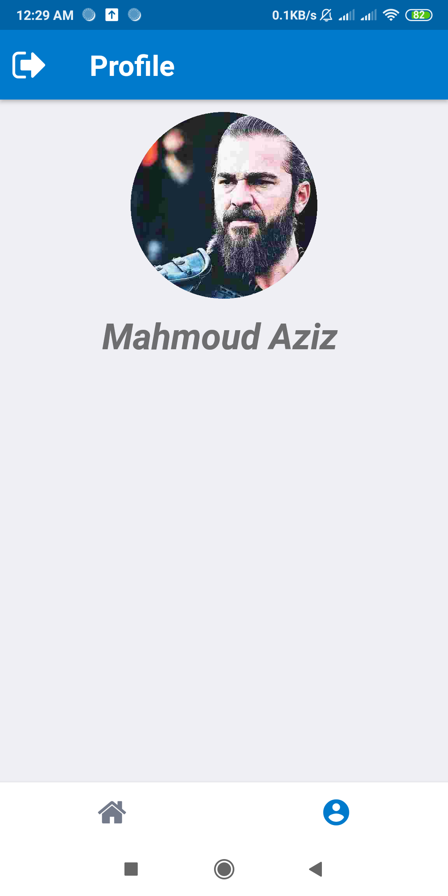
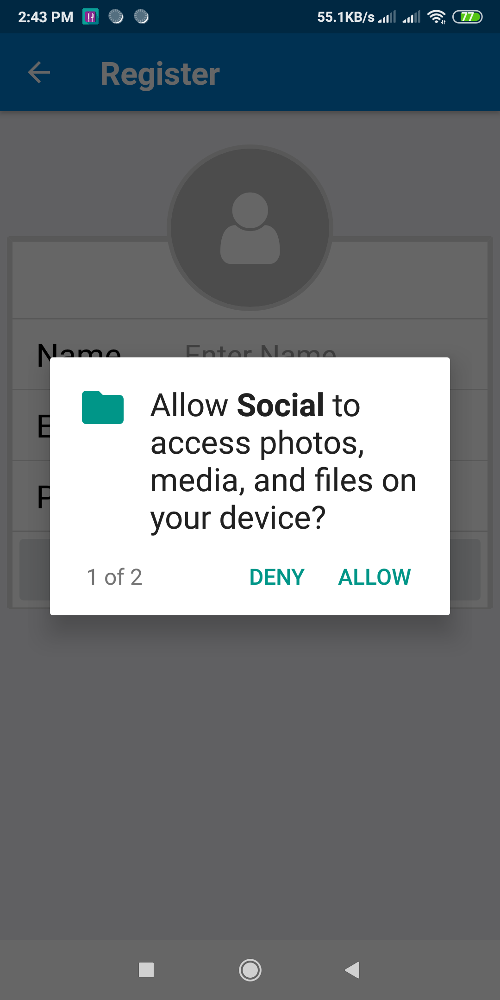

# Social-App
Social app using react-native

# Techniques used
<Ul>
<li>Redux- Redux-thunk</li>
<li>Navigations</li>
<li>Handling Run Time Permissions</li>
<li>Api Request ( Json )</li>
<li>third part library like image-picker, react-native-element, ...</li>
<li>using camera, using studio images</li>
</Ul>

# Screen Shot
    
